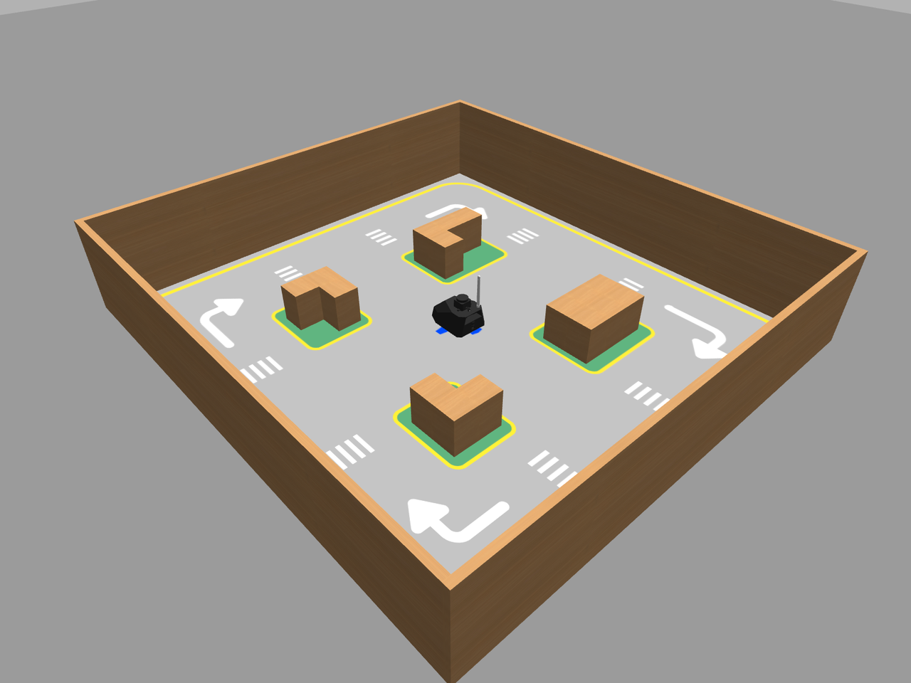
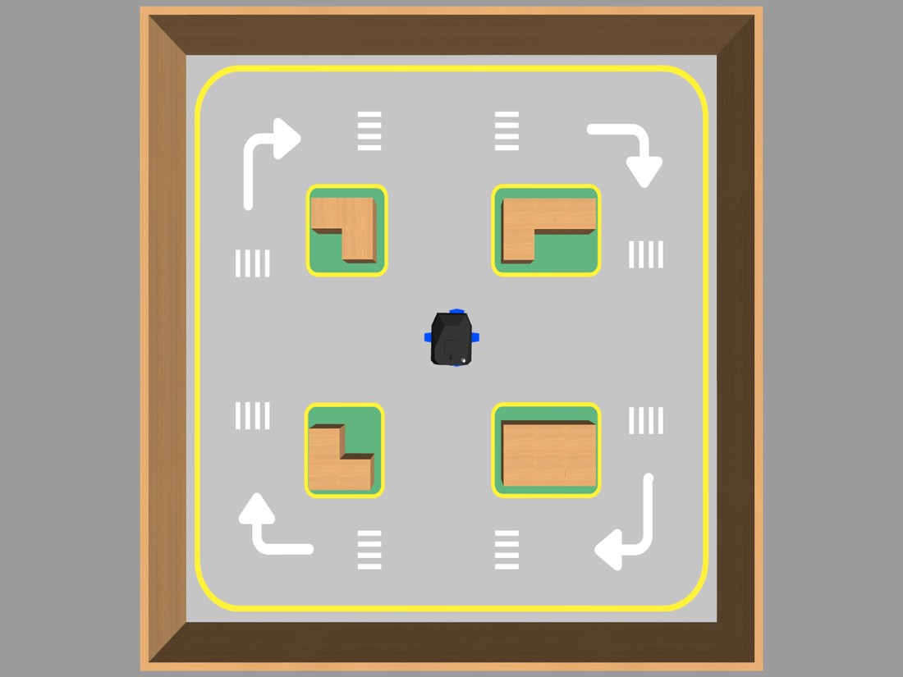

# Simulación NEXUS

Simulación en Gazebo del robot **NEXUS** (Kit Kalman) para **ROS 2 Humble**, usada en los cursos de Kalman Robotics.



- [Simulación NEXUS](#simulación-nexus)
  - [Requisitos](#requisitos)
  - [Instalación](#instalación)
  - [Uso](#uso)
  - [Referencias](#referencias)

## Requisitos

- Ubuntu 22.04 con ROS 2 Humble instalado.

## Instalación

**1. Crea el workspace de simulación con su carpeta `src` (si ya lo tienes, ve al paso 2):**

```bash
mkdir -p ~/sim_ws/src
```

**2. Clona este repositorio dentro de `src`:**

```bash
cd ~/sim_ws/src
git clone https://github.com/Kalman-Robotics/sim-nexus.git
```

**3. Descarga las dependencias con rosdep:**

Si es la primera vez que usas `rosdep` en tu máquina, inicialízalo:

```bash
sudo rosdep init
rosdep update
```

Luego, desde la raíz del workspace, instala todo lo que los paquetes necesitan (Gazebo incluido):

```bash
cd ~/sim_ws
rosdep install --from-paths src --ignore-src -r -y
```

**4. Compila el workspace y actívalo:**

```bash
colcon build
source install/setup.bash
```

## Uso

Verifica que los paquetes estén disponibles:

```bash
ros2 pkg list | grep kalman
```

Lanza la simulación:

```bash
ros2 launch kalman_gazebo simulation.launch.py
```

El NEXUS aparece en el **laboratorio** (`laboratorio_real.world`), la réplica de la
pista física de Kalman: un recinto de 1,45 × 1,55 m con paredes de melamina de 30 cm
y un circuito de calles con cuatro manzanas, pasos de cebra y flechas de giro.
**Es el mundo del curso**: lo que pruebes aquí es lo que después vas a correr sobre
el robot real, así que las distancias y los obstáculos son los mismos.



El robot arranca en el centro del circuito, con unos 25 cm libres alrededor. Las
calles miden 40 cm de ancho, más del doble que el NEXUS (14 × 11 cm), así que se
puede recorrer el circuito entero sin rozar las manzanas.

Los demás mundos son escenarios extra para experimentar:

```bash
ros2 launch kalman_gazebo simulation.launch.py world:=laboratorio.world
ros2 launch kalman_gazebo simulation.launch.py world:=living_room.world
ros2 launch kalman_gazebo simulation.launch.py world:=vacio.world
```

| Mundo | Qué es |
| --- | --- |
| `laboratorio_real.world` | **(por defecto)** la pista real: recinto de 1,45 × 1,55 m con el circuito de 4 manzanas |
| `laboratorio.world` | maqueta de ciudad sobre un tapete de 2,5 m, con ~20 edificios |
| `living_room.world` | sala de estar con muebles (y sus variantes `living_room2..4`) |
| `vacio.world`, `empty_world.world` | suelo desnudo, para probar el robot sin obstáculos |

El robot arranca en un punto despejado propio de cada mundo. Si quieres otro,
pásalo a mano:

```bash
ros2 launch kalman_gazebo simulation.launch.py x_pose:=-0.9 y_pose:=0.4
```

Para cerrar la simulación, presiona `Ctrl+C` en la terminal.

## Referencias

- [Kit Kalman ROS 2 (robot real)](https://github.com/Kalman-Robotics/kit-kalman-ros2)
- [Kalman Robotics](https://kalmanrobotics.io/)
