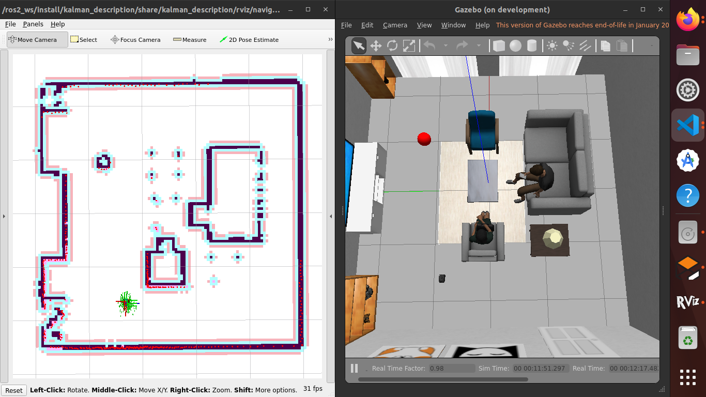

# kalman_gazebo package 

- [kalman\_gazebo package](#kalman_gazebo-package)
  - [Archivos Launch](#archivos-launch)
    - [`simulation.launch.py`](#simulationlaunchpy)
    - [`self_drive_gazebo.launch.py`](#self_drive_gazebolaunchpy)
  - [Uso](#uso)
  - [Aplicaciones](#aplicaciones)
    - [Comando por Teclado](#comando-por-teclado)
    - [Navegación Autónoma](#navegación-autónoma)

## Archivos Launch

### `simulation.launch.py`
Lanza la simulación de Gazebo con el robot Kalman.

**Argumentos:**
- `use_sim_time`: Usar reloj de simulación (Gazebo) si es verdadero (default: `true`)
  - Valores aceptados: `true`, `false`
- `robot_model`: Nombre del paquete de descripción del robot (default: vacío, usa configuración)
- `x_pose`: Posición inicial X del robot (default: `-2.0`)
- `y_pose`: Posición inicial Y del robot (default: `-0.5`)
- `world`: Nombre del archivo de mundo (default: `living_room.world`)

### `self_drive_gazebo.launch.py`
Lanza el nodo de evitación de obstáculos simple para Gazebo. Se suscribe a LaserScan y Odometry (yaw), publica velocidad. Cada 10 ms elige un estado (avanzar, girar izquierda, girar derecha) según los umbrales "check.angle" y "check.distance" y publica las velocidades correspondientes. 

**Argumentos:**
- `robot_model`: Nombre del paquete de descripción del robot (default: vacío, usa configuración)

## Uso
Para lanzar la simulación de Gazebo con el robot Kalman, use el siguiente comando:
```
ros2 launch kalman_gazebo simulation.launch.py robot_model:=kalman_description world:=laboratorio_real.world
```

## Aplicaciones
Para ejecutar las utilidades de los paquetes de Kalman, asegurese de configurar el argumento `use_sim_time` a `true` para sincronizar con el tiempo simulado de Gazebo.

### Comando por Teclado
Para controlar el robot Kalman en la simulación de Gazebo usando el teclado, use el siguiente comando:
```
ros2 run kalman_teleop teleop_keyboard 
```

### Navegación Autónoma
Para lanzar la navegación autónoma en un entorno simulado, use el siguiente comando:
```
ros2 launch kalman_bringup navigation.launch.py use_sim_time:=false robot_model:=kalman_description slam:=False map:=/ros2_ws/src/kalman_bringup/map/living_room.yaml
```


